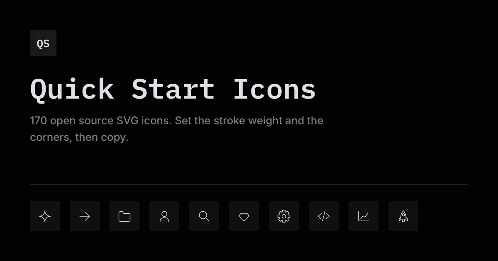

# Quick Start Icons

170 open source SVG icons with a live stroke weight and a corner toggle.

<!-- Static badges only: shields.io's GitHub-API badges fail intermittently
     ("Unable to select next GitHub token from pool"). Bump the count by hand. -->
[](src)
[](site/build.mjs)
[](LICENSE)



Quick Start Icons is a set of outline icons for people scaffolding a new project. Every icon is drawn by hand as a live stroke on a 32 by 32 canvas, so the stroke weight and the corner style are controls on the site rather than separate downloads. Set them, then copy one icon or download all 170. No npm package, no icon font, no runtime.

## Use them

Grab an icon from **[the site](https://icons.evanpizzolato.com)**, or take the SVG straight from [`src/`](src). Each file is complete and self-contained:

```html
<svg xmlns="http://www.w3.org/2000/svg" width="24" height="24"
     viewBox="0 0 32 32" fill="none" stroke="currentColor"
     stroke-width="1.25" stroke-linecap="round" stroke-linejoin="round">
  <path d="M16 6L16 26"/>
  <path d="M6 16L26 16"/>
</svg>
```

The stroke is `currentColor`, so an icon inherits the CSS `color` of its parent and follows a theme change without a second copy.

## How the two controls work

Every source carries its presentation attributes on the root element and nothing on the children. That one rule is what lets a single CSS declaration restyle all 170 icons at once.

**Stroke weight** is one custom property. `.glyph svg { stroke-width: var(--qs-weight) }` beats the root attribute and inherits the whole way down, so moving the slider writes to one element and 170 icons repaint.

**Corners** is harder, because corners are authored three different ways in SVG:

| Authored as | Count | Squared by |
|---|---|---|
| `rect[rx]` | 41 rects | one CSS rule reading a `--base-rx` set at build time |
| `stroke-linejoin="round"` | every straight-to-straight join | `stroke-linejoin: miter` |
| an explicit arc in the path data | 131 arcs across 58 paths | `site/square-path.mjs`, at build time |

`stroke-linecap` stays `round` in both modes and is not a dial: 24 dots across 14 icons are authored as `<path d="M9 16h.01"/>` and only exist because a round cap draws them.

The third is baked geometry that no CSS property reaches, so the build derives the squared alternative: any circular minor arc tangent to the straight segments on both sides of it is replaced by the vertex where those two tangents meet, at any corner angle. The swap is lossless, and squaring a filleted outline reproduces its original vertices exactly.

Two escape hatches, both documented in [`SPEC.md`](SPEC.md):

- **`data-corner="fixed"`** skips a path. The test for "this arc is a corner" is geometric, and geometry cannot tell a folder's corner from a person's shoulder. Seven paths across six icons carry it.
- **`data-d-square="..."`** states a path's squared geometry outright, for the case derivation cannot reach: a stroke that stops on a fillet belonging to another path has no arc of its own to work back from.

## Build the site

```bash
node site/build.mjs
cd site/dist && python3 -m http.server 8787
```

Serve it rather than opening `dist/index.html` directly. `file://` is not a secure context, so `navigator.clipboard` is unavailable there.

`site/build.mjs` is the only build step and has no dependencies. It reads `src/*.svg`, inlines all 170 into one static page, and writes `robots.txt`, `sitemap.xml` and `llms.txt` beside it. See [`site/README.md`](site/README.md) for the details.

## Contributing an icon

Read [`SPEC.md`](SPEC.md) first. It covers the canvas, the identical root every file carries, the corner rules, and when a shape needs a real fillet rather than a round line join. The build refuses any source whose root does not match, so a file that violates the spec fails loudly rather than shipping.

## License

MIT. Use them in personal and commercial work, modify them, ship them inside a product you sell. Attribution is appreciated and not required.
